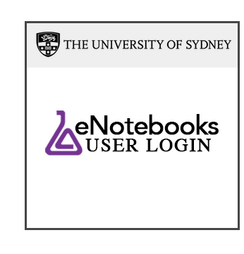

+++ 
title = "eNotebooks" 
draft = false 
+++

eNotebooks (formerly Electronic Lab Notebooks, or ELNs) provide you with a collaborative working tool suitable for both internal and external collaborators. eNotebooks can be used in any discipline and are a great option for curating, storing and sharing working documents, procedures, observations, conclusions, notes, images and data files.

## Features

* **Searching** - eNotebooks are designed to be searched by keyword or tag.
* **Sharing and collaboration** - connect to more researchers and provide access to your research data by choosing to share all or part of your eNotebook within your research team, external collaborators, even with the public.
* **Research data management** - eNotebooks promote good practice by keeping protocols, observations and digital data all in one place.
* **Portability** - access your research anywhere, anytime, from almost any device.
* **Record keeping** - eNotebooks are a source of evidence of responsible research conduct, inventorship and authorship for patents and research publications.
* **Secure** - eNotebooks are secure, password-protected and has been independently certified by ICT data security consultants. Access to the eNotebook is via UniKey, and can be restricted to the notebook owner or authorised members of the research team.
* **Free** - full account provided free to staff, students and affiliates.

## Getting started

1. Visit [https://aushib.labarchives.com/select_institution](https://aushib.labarchives.com/select_institution), bookmark this link
1. Under **I want to login to my LabArchives account through my institution**, select The University of Sydney.
1. You will be redirected to a University of Sydney UniKey login.
1. Enter your UniKey and UniKey password to login.
1. Select the option **I do not have a LabArchives account and need to create one**.
1. Once selected, a new page will appear showing your University of Sydney identifiers. Select **Create new account**.
1. Once you have set up your account, the links below will give you an overview of some of the basic functions of the eNotebook.

For any questions or help contact:
<digital.research@sydney.edu.au>

## Basic overview

* [Adding content](./adding-content/) - an overview of folders, pages and various entry types
* [Sharing content](./sharing-linking/) - how to share your eNotebook with others
* Tracking activity - **coming soon**
* Organising your eNotebook - **coming soon**
* [Offboarding](./offboarding/) - recommendations for leaving the university or archiving a notebook

## Advanced features

* [Research Data Store (RDS) Integration Widget](./rds-integration/) - to link files on the RDS in your eNotebooks
* [Microsoft Office Plugin](./ms-office-plugin/) - accessing documents in your eNotebooks through your desktop applications
* [GraphPad Prism Plugin](./prism-plugin/) - directly saving Prism files into your eNotebooks
* [Mobile App](./mobile-app/) - accessing your eNotebooks through your mobile device
