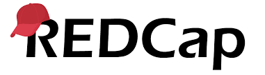
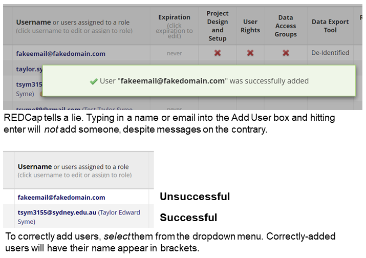

+++ 
title = "REDCap" 
draft = false 
+++

[Research Electronic Data Capture (REDCap)](https://redcap.sydney.edu.au) is an online, customisable data capture tool. It provides the ideal means to gather data in a secure environment and avoids the need to enter data into spreadsheets or use paper-based forms and surveys.

At its most basic, you can use the REDCap functions to build data collection forms consisting of &quot;variables&quot; which take the appearance of text boxes, check boxes, dropdown menus, and so on. These forms can also be made accessible over the internet to research participants as &quot;surveys&quot;. Filling out these forms enters data directly into a secure database on the REDCap server.

**Reasons to use REDCap**

- **Fast and flexible** – building a project from scratch is a simple matter of point-and-click using your internet browser.
- **Clean data** – REDCap makes it easy to collect clean data as your data collection forms can be standardised and include validation and data quality rules.
- **Suitable for &quot;highly protected&quot; data** – data is stored securely, is encrypted in transit and at rest, and resides on University-managed servers within NSW. Unless you export data to your personal device, the data is always stored securely on these servers. REDCap has been approved by ICT as suitable for data classified as &quot;highly protected&quot; under the University's data classifications.
- **Secure collaboration –** both UniKey holders and external collaborators can benefit from simultaneously accessing data on REDCap in a secure, encrypted manner. Access to specific data and functions in REDCap are highly customisable for each user.
- **Import and export** – even if your data isn't currently in REDCap, you can easily build a suitable project and bulk upload existing data to ensure it meets relevant data handling requirements. Data can be exported to CSV, PDF, SAS, Stata, R, or SPSS for analysis. Identifying information can be removed with one click if required.
- **Powerful** – REDCap can be used to manage longitudinal clinical trials and includes features such as audit trails, randomisation, scheduling, data access groups, and a data resolution workflow module, amongst others.
- **Free and supported** – The University's installation of REDCap is maintained by ICT specifically for University of Sydney researchers and their affiliates. Functional support and training are available from Sydney Informatics Hub. Both services are free-of-charge. There is also a highly-engaged community of REDCap users both internationally and within the University (via our Yammer group).

This guide is divided into the following sections:

**REDCap at the University of Sydney**

- [Is REDCap at the University of Sydney the same as REDCap at other institutions?](#redcapusyd)
- [Is there a REDCap user manual? How do I use REDCap?](#usermanual)
- [What REDCap support is provided by the University?](#support)

**Access and Creating Projects**

- [What software will I need to use REDCap?](#software)
- [Who can access REDCap?](#accesswho)
- [How do UniKey holders access REDCap?](#accessunikey)
- [How do external users access REDCap?](#accessexternal)
- [Why can't I see any projects when I first log in?](#noprojects)
- [How do I grant users access to specific REDCap projects?](#accessproject)
- [Why can't I find a user in the list when I try to add them to my project?](#finduser)
- [I added a user but they cannot access the project, what is going on?](#badadd)
- [How do I create a new REDCap project?](#create)
- [What should I do if I forget my password?](#forget)
- [I can't log in to REDCap, it says invalid username or password - what do I do?](#invalid)

**Data Entry, Export and Management**

- [Why do I need to move my project into Production mode before collecting data?](#production)
- [Does REDCap offer de-identification methods for data exporting?](#deident)
- [What do I do with the data when the project is finished? Can it stay on REDCap indefinitely?](#longterm)
- [How do I export the data from my REDCap project?](#export)
- [How can I enter data in REDCap when I don't have an internet connection?](#nointernet)
- [Do I need to back up my REDCap project?](#backup)
- [How do I manage multi-site projects using Data Access Groups (DAGs)?](#dags)

**Other questions**

- [Am I able to create a multi-language project (containing forms in different languages)?](#langs)

## REDCap at the University of Sydney

### Is REDCap at the University of Sydney the same as at other institutions?

Each institution maintains their own &quot;installation&quot; of REDCap. These are all completely independent systems with separate user lists and are often updated to newer versions at different times. This means that if you have logged in to REDCap at another institution (e.g. NSW Health), you will not be able to access your University of Sydney REDCap projects through the other institution's REDCap application, and vice versa. Furthermore, features you may have used at different institutions or read about online may not necessarily apply to the version in use at the University. The current version number can be found at the bottom of any page within REDCap.

### Is there a REDCap user manual? Where can I find information about how to use REDCap?

There is no official manual for using REDCap. However, an extremely comprehensive, unofficial manual has been assembled by passionate REDCap administrators from other institutions. [You can access a copy of this manual, with institution-specific information removed, here.](https://informatics.sydney.edu.au/rdm/redcap/REDCap_User_Guide_v4.4_Vanderbilt_edited.pdf)

<b>We highly recommend reading the unofficial manual before asking for support. Your question is likely to be found in the manual.</b>

In addition, there is a comprehensive &quot;Help and FAQ&quot; section accessible along the top of the home page once you log in. REDCap also has training videos accessible on the home page, as well as further videos scattered around within the pages of REDCap itself. Helpful information about specific settings are usually found alongside the setting themselves. Look for the hyperlinks and question marks.

Being free to use by not-for-profit organisations, REDCap is used by a passionate international community and plenty of information about how to use REDCap is freely available online. Information provided by different institutions is usually applicable to our installation of REDCap, but note that different versions may have different features.

You are highly encouraged to seek out the answer to your question online before contacting the University for specific support.

### What REDCap support is provided by the University?

ICT supports the underlying IT infrastructure for REDCap, ensuring that it is running, available, secure and updated. They do not provide functional support for REDCap. 

The Research Data Consulting team at Sydney Informatics Hub (a Core Research Facility, part of the DVC-Research portfolio) are the REDCap administrators. They provide functional support, project change approval, and training for REDCap. They are not IT specialists, but rather, come from research backgrounds themselves and support our research community in using research data management platforms provided by the University, of which REDCap is only one. For more information on research data management at Sydney, [see here](#https://informatics.sydney.edu.au/rdm/). This team can be contacted at [digital.research@sydney.edu.au](mailto:digital.research@sydney.edu.au).

Please note that the Research Data Consulting team may not be able to respond to minor queries. Before contacting them, you are encouraged to exhaust available online sources for your answer. [An excellent resource is the unofficial manual.](https://informatics.sydney.edu.au/rdm/redcap/REDCap_User_Guide_v4.4_Vanderbilt_edited.pdf)

You are also encouraged to post your question in the [REDCap Users Group on the University of Sydney's Yammer](https://www.yammer.com/sydney.edu.au/#/threads/inGroup?type=in_group&amp;feedId=7377541), which is an active group of over 100 University of Sydney REDCap users. Posting your question will also benefit other users with similar questions and stimulate discussion on the topic.

The Research Data Consulting team at SIH runs REDCap workshops and webinars, free of charge to University staff, students, and affiliates. For more information, please see [https://informatics.sydney.edu.au/training](https://informatics.sydney.edu.au/training)

The Clinical Trials Data Lead at the Clinical Trials Support Office (within the Ethics and Integrity team at the DVC-Research portfolio) is a REDCap Administrator supporting clinical trials researchers in ensuring their REDCap project has been designed in compliance with ICH-GCP principles. The Clinical Trials Data Lead addresses access control, data quality and integrity, data queries and the quality process and ensures that researchers are making best use of REDCap for their clinical trial. For enquiries or to arrange a consultation, the Clinical Trials Data Lead can be contacted at [clinical-trials.research@sydney.edu.au](mailto:clinical-trials.research@sydney.edu.au)

## Access and Creating Projects

### What software will I need to use REDCap?
To access REDCap, you will need to have an up-to-date internet browser. No other software is needed. REDCap is also accessible on smartphones and mobile devices, although it will display differently due to being optimised for the device's smaller display.

### Who can access REDCap?
REDCap is available to all University staff, students and affiliates who hold a UniKey.

External users (both institutional and non-institutional, including NSW Health) can gain access to the University's REDCap if they are working on a project with a University of Sydney researcher. External users cannot use the University's REDCap for their own purposes. External users may join projects created by UniKey holders but may not create new projects themselves, as our licence agreement with the vendor of REDCap stipulates that only UniKey holders can create new projects.

Note: participants completing surveys you have designed on REDCap do not need to log in. REDCap generates unique web links for surveys which are accessible by participants.

### How do UniKey holders access REDCap?

To access REDCap as a UniKey holder:

1. Go to [https://redcap.sydney.edu.au/](https://redcap.sydney.edu.au/)
2. Click on the orange Australian Access Federation button. You will be taken to the &quot;Login to Federated Services&quot; page.
3. Search for University of Sydney in the list of organisations
4. Select **The University of Sydney** and click &quot;Continue to your organisation&quot;.
5. You will be taken to the University's &quot;Australian Access Foundation - AAF Login&quot; page
6. Enter your UniKey and UniKey password and select &quot;Continue&quot;.

### How do external users access REDCap?

#### As an institutional user

If the user is a member of an Australian university or research institution (including NSW Health), they will be able to access REDCap using their own institutional login through the Australian Access Federation (AAF) - [see the list of participating organisations](https://aaf.edu.au/subscribe/subscribers.html).

#### NSW Health users

Please note that NSW Health users, like all external users, can only access USYD's REDCap if they are working on a specific USYD research project.

NSW Health users working on University of Sydney research projects can use AAF to access the University's REDCap once they have had their AAF credentials activated by eHealth NSW. They can do this by contacting the NSW Health State Wide Service Desk and requesting access to &quot;REDCap at the University of Sydney&quot; (we have been advised by NSW Health that using that exact phrase will aid their Service Desk in finding the correct instructions to follow). We have heard from NSW Health employees that the State Wide Service Desk will sometimes claim to not be able to help, however, experience from NSW Health employees shows that persistance may be required and always results in success. Ensure your request is directed towards the "Frontline Technical Support Services" team. 

#### As a non-institutional user

If the user is not a member of an Australian university or research institution, they must have access requested for them by a University of Sydney member of staff, student or affiliate as follows:

1. Log a request through the [Services](http://sydneyuni.service-now.com/sm) Portal
2. Search for &quot;[Access to REDCap (External Users)](https://sydneyuni.service-now.com/sm?id=sc_cat_item&sys_id=e34b5028497ba100bd818450a48d4569)&quot; (or click this link)
3. In the last field of the form, provide each external user's full name and email address.

Once their account has been created, non-institutional users will receive an email with login instructions.

Non-institutional users may log in to REDCap as follows:

1. Go to [https://redcap.sydney.edu.au](https://redcap.sydney.edu.au/)
2. Click on the &quot;Non-institutional login&quot; tab
3. Enter the Username you received in your email from the University of Sydney administrators
4. Create a password
5. Click on Log In.

If a non-institutional user forgets their password, they will need to contact the University of Sydney administrators to have their password reset. Administrators do not have access to non-institutional users' passwords.

### Why can't I see any projects when I log in?

Your REDCap projects are found under My Projects along the top of the page.

If you can't see projects when you first log in, it is because either you haven't been granted access to existing projects or you haven't created any projects yet. It may also be because you have [not been correctly added to a project](#badadd).

You cannot add yourself to an existing REDCap project. If you are expecting access to an existing REDCap project and cannot see it, please contact your colleagues and ask them to add you to the project. The REDCap administrators are not permitted to add users to projects outside of exceptional circumstances.

### How do I grant users access to specific REDCap projects?

Prior to being added to a project, AAF users (including University users) must sign in to REDCap **at least once** to have their REDCap account generated. External users added via a request do not need to do this as their accounts are manually generated by the administrators.

When users are added their user privileges must be set. These can be set individually (custom rights) or they can be assigned to a role where the privileges are the same for all users in that role.

To add users to your REDCap project

1. From within your REDCap project, click on User Rights in the left-hand navigation pane.
2. In the Add New User box, start typing the user's full name and **select their name from the drop-down box** (do not hit Enter).
Note: Usernames for USYD users in REDCap are almost always different to a user's email address, despite appearing similar. Therefore, it is important that you **do not simply copy and paste their email** into the Add New User box. 
If you cannot find their name, please [see here](#finduser)
3. Check the checkboxes against the privileges you want to give to the user.
4. Click Add User.

**Correctly-added users will have their full name in brackets after their name**. If you do not see their name in brackets, they have not been added correctly, despite any messages REDCap may give you on the contrary. 

The process for adding users to a role is similar, although the role needs to be created first under Create New Roles in User Rights.

Users can have their custom rights changed or be assigned to a role later by clicking on their name in the user list.

### Why can't I find a user in the list when I try to add them to my project?
AAF users (USYD, NSW Health, other institutions, [see here](https://aaf.edu.au/subscribe/subscribers.html)) must sign in to REDCap **at least once** to have their REDCap account generated. Until they sign in for the first time, you will not see them on the list and will not be able to add them to your project. 

If the user has an account generated by submitting an external user request form, you should be able to add them once this account has been generated by the admins. The user will not need to log in initially in these cases.

### I added a user but they cannot access the project, what is going on?
There are a few common causes:

1. You had not added the user by selecting from the dropdown menu of existing accounts. Please [see this note](#namebrackets)
2. The user may have multiple accounts. For example, a user may have an account accessed via logging in with their USYD credentials, and a separate account accessed via logging in with their NSW Health credentials. These accounts are independent and not linked. Please ensure 

### How do I create a new REDCap project?

To create a new REDCap project:

1. Log into REDCap
2. Click &quot;New Project&quot; along the top of the page (see note below if this button is not visible).
3. Enter a Project Title
4. Select the Purpose of this project
If the project is for research purposes, please enter the name of the Lead Investigator and their email address
5. Select &quot;Create an empty project&quot; OR &quot;Use a template&quot;
6. Click &quot;Create Project&quot;

Once your REDCap project is created you can start to build your project's data collection forms or surveys.

Note: Only UniKey holders are permitted to create new projects. This is a condition of the license agreement the University of Sydney holds with the REDCap vendor. External users (including those from NSW Health and other AAF institutions) will not see the &quot;New Project&quot; button at the top of the page.

Note: If you are a UniKey holder and cannot see the &quot;New Project&quot; button, please contact the Research Data Consulting team at [digital.research@sydney.edu.au](mailto:digital.research@sydney.edu.au)to have this corrected.

### What should I do if I forget my password?

If you log in to REDCap using a UniKey, you will need to contact the University Service Desk on 9351 2000 (option #2) to get your password reset by ICT. Alternatively, you can bring photo ID to a staffed ICT computing space and have your password reset in person.

If you log in to REDCap as a non-institutional external user using the username provided to you by the REDCap administrators, you will need to arrange for the project owner to contact the Research Data Consulting team at [digital.research@sydney.edu.au](mailto:digital.research@sydney.edu.au) to request your password to be reset.

If you log in to REDCap using AAF and your credentials from a different institution (including NSW Health), you will need to contact your own institution's IT department.

### I can't log in to REDCap, it says invalid username or password - what do I do?

The following are common causes for being unable to access REDCap using your UniKey and UniKey password:

- You may need to synchronise your password. For more information see: [How do I synchronise my UniKey? (link to form)](https://www.auth.usyd.edu.au/extro/pwresync/)
- You have forgotten your Unikey password. For more information see &quot;What should I do if I forget my password?&quot; on this page.

If you are still having trouble logging in to REDCap, please contact the University Service Desk on 9351 2000 (opt #2).

If you were added as a non-institutional external user (i.e. you were originally sent an email from the REDCap Administrators with a link to set up your password), please ensure you are clicking on the external user sign-in link and not on the orange AAF button.

Non-institutional external users will need to arrange for the project owner to contact the Research Data Consulting team at [digital.research@sydney.edu.au](mailto:digital.research@sydney.edu.au) to request your password to be reset.

## Data Entry, Export and Management

### Why do I need to move my project into Production mode before collecting data?

Moving your project to Production mode before you start collecting study data provides your project with a &quot;safety net&quot; to ensure you do not inadvertently corrupt or delete your research data.

Any changes you make to variables in your project in Production mode will be cached then submitted for review. REDCap may automatically approve these changes if it detects that they will not compromise your data. However, if REDCap thinks that it may do so, the changes will require approval by the REDCap administrators (the Research Data Consulting team). The administrators are automatically notified when you submit changes for approval. For more information, see Making Production Changes in the Help &amp; FAQ within REDCap.

A good example of a common mistake prevented by Production mode is re-coding of choices. REDCap only stores the value for the choice, not the text itself. Imagine you have the following choices for a question:

        0, Blue
        1, Green

and you try to change these instead to:

        1, Blue
        2, Green

If you already have records which have answered &quot;1, Green&quot; these will be _changed_ to &quot;1, Blue&quot;, as REDCap simply stores a &quot;1&quot;. Likewise, any records which have answered &quot;0, Blue&quot; will have this data _deleted_ as &quot;0&quot; is no longer an option for this variable.

Any attempts to make a change like this will be sent to the REDCap administrators. They will send you an email asking if you are aware of the impact of the changes, to which you must reply and instruct them how to proceed. The administrators can only accept or reject the entirety of changes submitted, they cannot approve a subset of changes nor edit the changes for you.

### Does REDCap offer de-identification methods for data exporting?

Yes, REDCap offers advanced de-identification options that can be optionally used when exporting data, such as removing data from fields marked as &quot;identifier&quot; fields, removing free-text fields, removing date fields and utilising date shifting. These options provide greater security and data protection when a user is exporting sensitive data from REDCap and are offered when exporting the data.

### What do I do with the data when the project is finished? Can it stay on REDCap indefinitely?

When your project is complete, you are advised to export the data from REDCap and store it in an appropriate place long-term. The REDCap server is not intended as a long-term storage solution for data.

Depending on your User Rights, your entire project, including all data and REDCap settings (such as automated survey invitation settings), can be downloaded in a single XML file by going to &quot;Project Setup&quot; \&gt; &quot;Other Functionality&quot; and clicking &quot;Download metadata &amp; data&quot;. Note that this does not download the logging history (audit trail), but if you wish to obtain it, you may download it at the top of the Logging page.

The XML file is a convenient way to archive a project, but it does not provide easy access to the data itself. If you wish to continue working with the collected data, you should also export the entire dataset as a CSV file, as described in the section on exporting data below.

It is important that the location the data is to be stored in long-term is consistent with both your [Research Data Management Plan](#https://informatics.sydney.edu.au/rdm/dashr/#rdmp) and ethics approval (if applicable). If you decide to alter your plans, please update these documents accordingly. Also be mindful of security: if your data is classified as "highly protected" (e.g. identifing health information) then you must ensure it is also [encrypted](#https://sydneyuni.service-now.com/sm?id=kb_article_view&sysparm_article=KB0010877).

### How do I export the data from my REDCap project?

Data captured in REDCap can be exported in a variety of file formats and can be de-identified (when identifying fields have been specifically labelled). The &quot;Data Exports, Reports, and Stats&quot; page (in the left-hand navigation pane) allows for the entire project to be exported or for specific forms or fields to be exported by creating Reports.

Note: your ability to export data may be limited by your User Rights.

To download instrument data from your REDCap project:

1. In your project, click on &quot;Data Exports, Reports, and Stats&quot; (in the left-hand navigation pane)
2. To download data from all instruments (excluding files uploaded to a &quot;File Upload&quot; field), click the Export Data button for the report named &quot;All data (all records and fields)&quot;. To download specific data, click Create New Report and enter the criteria for the data to be downloaded (e.g. select fields from within your project and optional filters).
3. Download the data in the preferred format: Microsoft Excel (CSV), SPSS, SAS, R, Stata or CDISC ODM (XML) by clicking on the corresponding icon from the &quot;Choose export format&quot; column. Also select de-identification options, if desired.
Note: when exporting as a CSV, &quot;raw data&quot; will export the variable names and coding (e.g. &quot;happy\_q1&quot; and &quot;1&quot;), whereas &quot;labels&quot; will export the field labels and choice labels (e.g. &quot;Is the patient happy?&quot; and &quot;Yes&quot;).

Files uploaded to &quot;File Upload&quot; fields will not be downloaded within the above file formats. To download all files uploaded to all data records as a ZIP file, go to the &quot;Other Export Options&quot; tab on the &quot;Data Exports, Reports and Stats&quot; page.

For more information see &quot;Data Exports, Reports and Stats FAQs&quot; located within REDCap's [Help &amp; FAQ page](https://redcap.sydney.edu.au/index.php?action=help#ss63).

Please keep in mind that data exported from REDCap will no longer be protected by the security of the REDCap server. If you are exporting to your personal device, you should ensure that your device is password protected and, in many cases, [encrypted](#https://sydneyuni.service-now.com/sm?id=kb_article_view&sysparm_article=KB0010877). 

### How can I enter data in REDCap when I don't have an internet connection?

There are two ways that data can be collected offline and sent to REDCap at a later time.

1. REDCap has a data import tool which can upload data into records using a spreadsheet. The data import template and further instructions are provided on the &quot;Data Import Tool&quot; page (in the left-hand navigation pane within your project).
2. The REDCap Mobile App is an app that can be installed on an Android or iOS tablet or mobile device so that data can be collected in an offline mode on that device. Later, when you are connected to the internet, it can then be synced back to your project on the REDCap server. Using the REDCap Mobile App requires API tokens to be provisioned. For more information, go to the REDCap Mobile App page (in the left-hand navigation pane within your project) to read more and watch related videos.

### Do I need to back up my REDCap project?

REDCap projects are backed up automatically on the University of Sydney's servers on a regularly scheduled basis. The backup data files are kept in a secure environment and are available for recovery.

However, we suggest that you temporarily back up your project yourself before making significant changes (e.g. changing the project via uploading a modified Data Dictionary). You can do this by exporting the data and the Data Dictionary, by downloading the entire project as an XML file (under the &quot;Other Functionality&quot; tab) or by simply copying the entire project to a new REDCap project (also under the &quot;Other Functionality&quot; tab). These abilities will be dependent on your User Rights and whether you are a UniKey holder or otherwise.

When exporting data to your personal device for backup, please consider where and how you save these files if they contain sensitive information. You should ensure you store them in-line with your ethics approval and the relevant data handling standard. For example, identifying health information could be stored encrypted on the Research Data Store (RDS). For more information about encryption, please see [How do I use file encryption?](https://sydneyuni.service-now.com/sm?id=kb_article_view&amp;sysparm_article=KB0010877) Once you have made your changes, we suggest that you delete your temporary back up if it contains sensitive information.

### How do I manage multi-site projects using Data Access Groups (DAGs)?

Access to data can be restricted by creating Data Access Groups, in which only users within a given Data Access Group can access records created by users within that group. This may be useful in the case of a multi-site or multi-group project that requires that groups not be able to access another group's data. The owner of the project will be able to see the records for all Data Access Groups.

It is critical to create Data Access Groups and assign users to them before data collection begins. DAGs also have implications for the naming of records. For more information, see the training video &quot;Data Access Groups for multi-site projects&quot;.

To create and edit Data Access Groups, go to the DAG page (next to User Rights) in the left-hand navigation pane within your project.

## Other questions

### Am I able to create a multi-language project (containing forms in different languages)?

Although REDCap does not have the ability to set multiple labels and answer sets for a question, there are a few options/workarounds for a multi-language project:

1. Create multiple projects with the same structure. You could do this in a simple manner by translating the data dictionary then uploading it into a new project.
An advantage is that you can re-use the same variable names in each project.
However, you need to manage multiple projects and keep them consistent, and you would then need to merge any exported data before analysis.
2. Create a language preference question at the start of form so the participant may select their language, and setup branching logic (conditional field display) to display the specified language selected.
An advantage is that you only have one project to manage.
A disadvantage of this approach is the same variable names cannot be used for each language.
3. Use branching logic to display the question in different languages via separate descriptive text fields, rather than including the question in the &quot;field label&quot; of the variable.
An advantage is that there is no need to duplicate variables either within the project or in separate projects.
A disadvantage is that the choice labels must be displayed in all languages simultaneously.

There are some things (e.g. 'Next Page' and 'Submit' buttons) that for technical reasons cannot be translated. The researcher may add descriptive text fields at the end of each page to translate 'Next Page', 'Previous' and 'Submit' buttons as needed.
